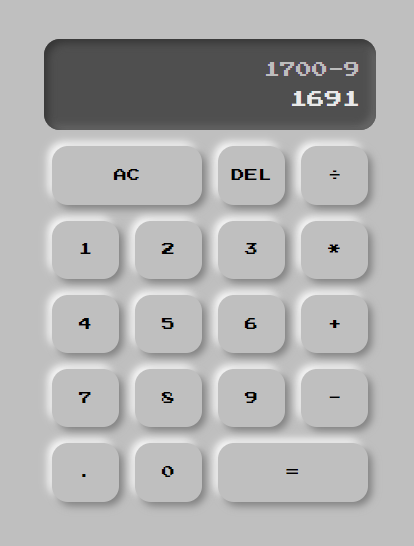

# Calculator neumorphism

## Introduction

> This is a calculator that works by clicking on the button. The whole style is inspired by neumorphism. The javascript works by calling function when a button is clicked.

